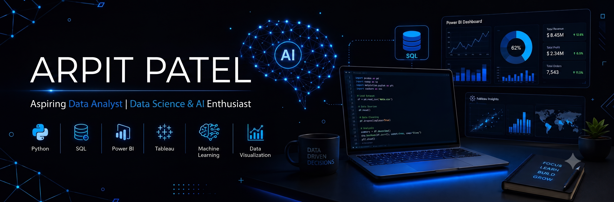

  

<h1 align="center">Hi 👋, I'm Arpit Patel</h1>
<h3 align="center">Aspiring Data Analyst | Data Science & AI Enthusiast | Python Developer</h3>

---

## 👨‍💻 About Me

🎓 Final Year B.Tech (Computer Science & Engineering) Student at **Babu Banarasi Das University**

📊 Passionate about solving real-world problems using **Data Analytics, Machine Learning, and Artificial Intelligence**

🌱 Currently pursuing **Data Science & AI Training + Internship**

💡 Interested in building data-driven applications and AI-powered solutions.

🚀 Goal: Become an Industry-Ready Data Analyst / Data Scientist.

---

## 🚀 Tech Stack

### Programming

- Python
- SQL

### Data Analytics

- Microsoft Excel
- Power BI
- Tableau
- Pandas
- NumPy

### Data Science

- Machine Learning
- Data Cleaning
- Data Visualization
- Statistics (Learning)

### Tools

- Git
- GitHub
- VS Code
- Jupyter Notebook

---

## 📚 Currently Learning

- Advanced SQL
- Power BI Dashboards
- Tableau Dashboards
- Machine Learning
- Statistics for Data Science
- Python for Data Analysis
- Git & GitHub
- AI Applications

---

## 💼 Featured Projects

### 📧 Spam Email Classifier
Machine Learning project that classifies emails as Spam or Not Spam using NLP techniques.

**Tech Used**
- Python
- Scikit-learn
- Flask
- HTML
- CSS

---

### 🌐 Personal Portfolio Website
A responsive portfolio website showcasing projects, skills, and achievements.

---

### 📚 Library Management System *(In Progress)*
A complete management system with authentication, issue/return books, and admin dashboard.

---

## 🎯 2026 Goals

- Build 15+ Professional Projects
- Master Data Analytics
- Master Machine Learning
- Contribute to Open Source
- Become an Industry Ready Data Scientist
- Secure a High-Paying Software/Data Role

---

## 📫 Connect With Me

📧 Email:
**arpitpatelchs@gmail.com**

💼 LinkedIn:
https://www.linkedin.com/in/arpit-patel-9b99b4389

---

⭐ Thanks for visiting my profile!
